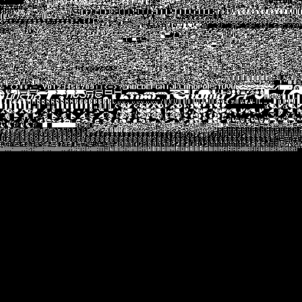
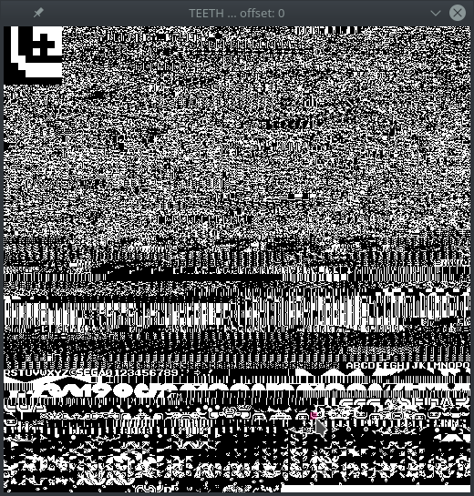

##Teeth

Teeth is program which visually presents byte patterns in SG-1000 ROMs. Tile and sprite data from SG-1000 games potentially manifest in the output, from which a screenshot can be saved for tile/sprite image extraction purposes using your favorite bitmap image editing software.

Teeth fills up an internal buffer of 256KB with each byte of the ROM file and displays it in 8 pixel x 8 pixel blocks. Because the data for tiles and/or sprites may not occur exactly aligned within an 8 x 8 block, the image can be offset (shifted) by pressing **UP** or **DOWN** arrow keys (or alternatively **A** and **Z**). By shiftig the offest, the rendering will begin at subsequent bytes 1 - 7 aiding alignment. For example, if the SG-1000 rom for Hustle Chumy is loaded, adjusting the offset to start at byte 5 will skip the first 5 bytes, and will align visible character tiles and sprites.

To save the full image with the currently selected offset, press ***s***.

A zoomed version of whichever tile the cursor is currently restsing on will be either displayed in the upper left or upper right corner of the screen depending upon which horizontal half of the  screen the cursor is positioned. This allows for ease of viewing individual tiles. Screenshots will not show the zoomed sample.

###Building

This program makes use of SDL2, so ensure you have installed the latest [SDL2](http://libsdl.org) library first. A makefile in included in this repository to make the executable.

###Running

Run the executable with one argument, the filename of the SG-1000 ROM to be viewed. These usually have extension ".sg".

Example:

`./teeth romfilename.sg`

To exit the program, close the program window or press **q**.

###License (BSD)

Copyright (c) 2016, Brian Puthuff
All rights reserved.

Redistribution and use in source and binary forms, with or without modification, are permitted provided that the following conditions are met:

1. Redistributions of source code must retain the above copyright notice, this list of conditions and the following disclaimer.

2. Redistributions in binary form must reproduce the above copyright notice, this list of conditions and the following disclaimer in the documentation and/or other materials provided with the distribution.

THIS SOFTWARE IS PROVIDED BY THE COPYRIGHT HOLDERS AND CONTRIBUTORS "AS IS" AND ANY EXPRESS OR IMPLIED WARRANTIES, INCLUDING, BUT NOT LIMITED TO, THE IMPLIED WARRANTIES OF MERCHANTABILITY AND FITNESS FOR A PARTICULAR PURPOSE ARE DISCLAIMED. IN NO EVENT SHALL THE COPYRIGHT HOLDER OR CONTRIBUTORS BE LIABLE FOR ANY DIRECT, INDIRECT, INCIDENTAL, SPECIAL, EXEMPLARY, OR CONSEQUENTIAL DAMAGES (INCLUDING, BUT NOT LIMITED TO, PROCUREMENT OF SUBSTITUTE GOODS OR SERVICES; LOSS OF USE, DATA, OR PROFITS; OR BUSINESS INTERRUPTION) HOWEVER CAUSED AND ON ANY THEORY OF LIABILITY, WHETHER IN CONTRACT, STRICT LIABILITY, OR TORT (INCLUDING NEGLIGENCE OR OTHERWISE) ARISING IN ANY WAY OUT OF THE USE OF THIS SOFTWARE, EVEN IF ADVISED OF THE POSSIBILITY OF SUCH DAMAGE.
